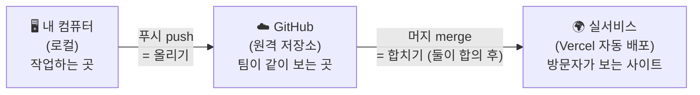

# 우리 팀 업무 플로우 — 한 장 요약 (비개발자용)

> 헷갈릴 때마다 이 문서를 본다. 솔·한빛 공용.
> 용어가 나오면 항상 "용어(쉬운 설명)" 형식으로 쓴다 — 이 문서가 그 사전이다.

---

## 0. 지도 먼저 — 코드는 세 곳에 있다



**핵심 한 줄: 내 컴퓨터에서 아무리 고쳐도 — 푸시 전엔 한빛이 못 보고, 머지 전엔 방문자가 못 본다.**

---

## 1. 용어 6개 — 이것만 알면 된다

| 용어 | 뜻 | 비유 |
|---|---|---|
| **브랜치** (branch) | 코드의 작업용 복사본. `main` = 실서비스 원본, `feature/...` = 우리가 작업 중인 복사본 | 원본 문서 vs 편집용 사본 |
| **커밋** (commit) | 변경사항을 하나로 묶어 저장 | 게임 세이브 포인트 |
| **푸시** (push) | 내 컴퓨터의 커밋을 GitHub에 올리기 | 클라우드 업로드 — **이때부터 한빛도 본다** |
| **PR** (pull request) | "이 작업본을 원본(main)에 합쳐도 될까요?" 요청서. 변경 내용과 검토 화면이 딸려 있음 | 결재 올리기 |
| **미리보기** (preview) | PR을 올리면 Vercel이 자동으로 만들어주는 테스트용 사이트 주소 | 시사회 — 실서비스 손대지 않고 화면 확인 |
| **머지** (merge) | 작업본을 main에 합치기 → **그 순간 실서비스가 자동으로 바뀜** | 결재 승인 + 즉시 시행 |

---

## 2. 한 번의 작업 사이클 — 이 순서 그대로

```
1️⃣ 시작    kfood-commercial-service 폴더에서 새 Claude 세션 열기
           → "인수인계 문서 읽고 이어가줘"

2️⃣ 지시    하고 싶은 걸 말로 시킨다 (AI가 코드 수정)

3️⃣ 확인    AI가 미리보기 화면을 띄우면 내 눈으로 확인한다
           (이상하면 "여기 이상해, 고쳐줘")

4️⃣ 올리기  "커밋하고 푸시해줘"
           → 이 순간 GitHub에 올라간다 = 한빛도 볼 수 있다

5️⃣ 마무리  "오늘 한 거 인수인계 정리하고 다음 프롬프트 갱신해줘"
           → 창 닫기. 끝.
```

- 4️⃣·5️⃣는 AI가 "세션 마무리 체크리스트"(session-handoff.md 맨 아래)대로 대부분 알아서 한다. 솔은 지시만 하면 됨.
- **머지는 이 사이클에 없다** — 머지(실서비스 반영)는 별도 이벤트다. 아래 §3 참고.

---

## 3. 한빛과 만나는 지점

| 언제 | 한빛이 하는 것 |
|---|---|
| 솔이 푸시할 때마다 | GitHub에서 변경 내용 확인 가능 (실시간 아님, 들어가서 봐야 함 — 슬랙 연결하면 자동 알림) |
| PR 검수 | PR 화면의 **Vercel 미리보기 링크**를 폰으로 열어 "기획 의도대로인가" 확인. 코드 읽기 불필요 |
| **사전 승인 필수 3가지** | ① DB 스키마(데이터 구조) 변경 ② 로그인·권한(RLS) 변경 ③ 환경변수 변경 |
| **머지** | 실서비스에 반영하는 결정 — 반드시 둘이 합의 후. 어느 한쪽이 임의로 누르지 않는다 |

---

## 4. 잘 되고 있는지 솔이 직접 확인하는 법 (AI 말 안 믿어도 되는 3가지)

1. **푸시가 됐나?** → github.com/kanghanbeat/kfood-commercial-service 접속 → 파일 목록 위 최근 커밋 메시지와 시간 확인
   - ⚠️ **왼쪽 위 브랜치 선택을 확인할 것!** `main`을 보고 있으면 옛날 화면, `feature/design-tokens-v2`를 선택해야 최신 작업이 보인다. **(전에 둘이 다른 화면을 본 이유가 이것)**
2. **작업 중인 화면은?** → PR #1 페이지 → Vercel 봇 댓글의 미리보기(Preview) 링크
3. **실서비스는?** → kfood-commercial-service-web.vercel.app — **머지 전엔 안 바뀌는 게 정상**

---

## 5. 헷갈릴 때 쓰는 마법의 문장

- 지금 상태를 모르겠으면 → 세션에 **"지금 상태 확인해줘 — 푸시 안 된 거 있어? 머지 안 된 거 있어?"**
- 이 문서로도 모르겠으면 → **"업무-플로우.md 기준으로 지금 몇 번 단계인지 설명해줘"**
- 용어를 모르겠으면 → 그냥 물어보기. (AI는 항상 용어(설명) 형식으로 답하게 되어 있음)

---

## 6. 슬랙 연결 (5분, 사람이 직접 — 다음 할 일)

목적: 푸시·PR·머지가 일어날 때마다 **둘의 슬랙 채널에 자동 알림** → "들어가서 확인"이 "알림 받고 확인"으로 바뀜.

1. 둘이 쓰는 슬랙 채널 하나 개설 (예: `#kfood-dev`)
2. 슬랙에 GitHub 앱 설치 → 채널에서 입력:
   `/github subscribe kanghanbeat/kfood-commercial-service`
3. 받을 알림 선택: `pulls`(PR), `commits`(커밋), `releases` 정도면 충분

이후 소통 규칙은 협업-가이드.md §B 그대로: "올렸다/머지됐다"는 알림이 대신하고, 사람은 "이 PR 봐줘 / 나 이거 크게 손볼게"만 말한다.
